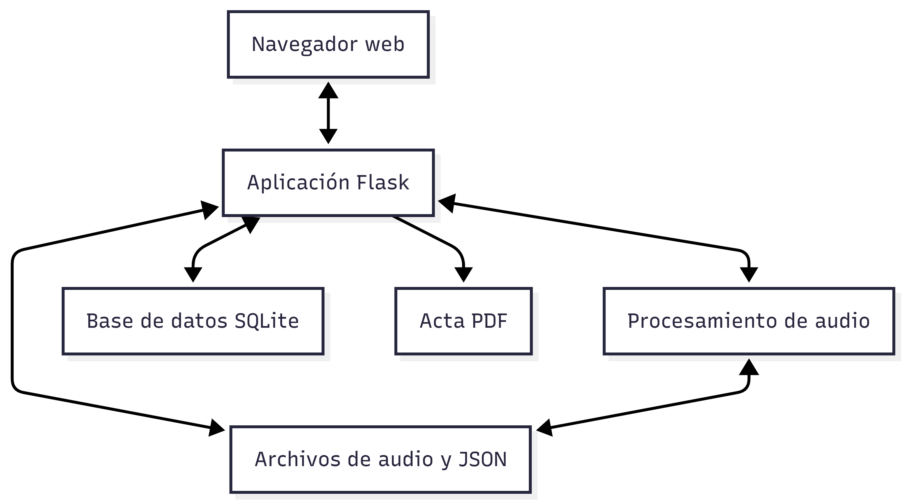
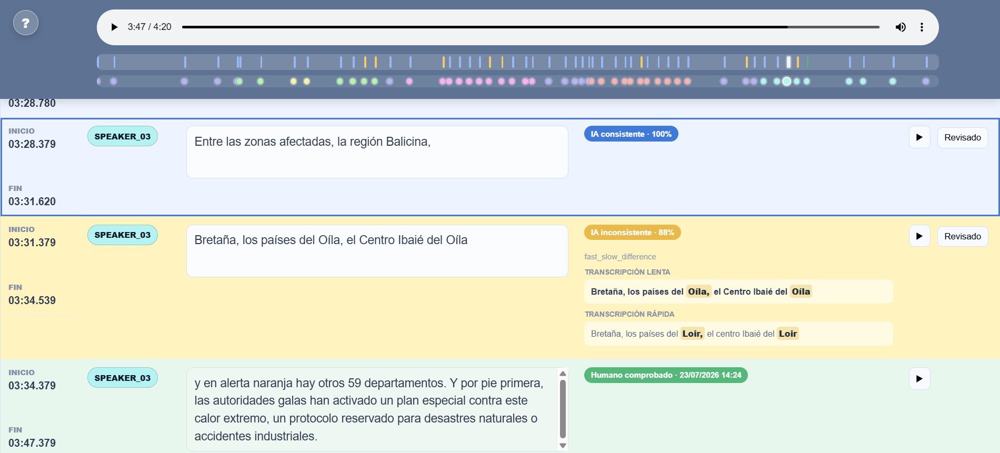
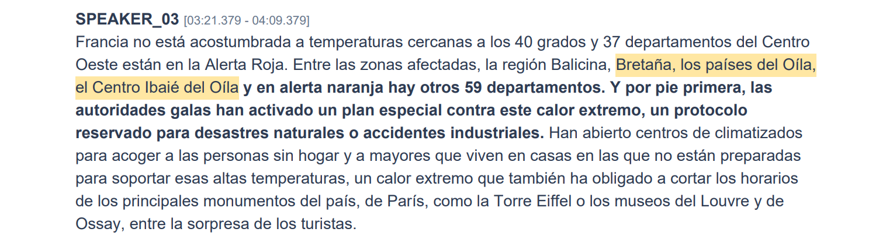

# TranscribeMatic

Aplicación web para la transcripción, diarización y revisión de reuniones, desarrollada como Trabajo de Fin de Grado en Ingeniería del Software.

TranscribeMatic permite procesar archivos de audio, identificar hablantes, comparar dos transcripciones automáticas, revisar manualmente los segmentos y generar un acta en PDF.

## Funcionalidades

* Gestión de usuarios y reuniones.
* Subida de audios en formatos MP3, WAV, M4A, MPEG y MP4.
* Transcripción automática mediante `faster-whisper`.
* Comparación de dos transcripciones con diferentes configuraciones.
* Identificación de hablantes mediante `pyannote.audio`.
* Renombrado de hablantes.
* Editor de segmentos con reproducción de audio.
* Identificación visual de segmentos consistentes e inconsistentes.
* Marcado de segmentos revisados manualmente.
* Registro local de acciones para la evaluación.
* Generación del acta de la reunión en PDF.

## Tecnologías utilizadas

* Python 3.12
* Flask
* SQLite
* faster-whisper
* CTranslate2
* pyannote.audio
* PyTorch
* ReportLab
* HTML, CSS y JavaScript

## Estructura principal

```text
TFG/
├── docs/
│   └── images/
├── models/
│   └── .gitkeep
├── src/
│   ├── data/
│   │   └── .gitkeep
│   ├── templates/
│   ├── .env.example
│   ├── aligner.py
│   ├── app.py
│   ├── db.py
│   ├── diarization.py
│   ├── email_sender.py
│   ├── init_server.py
│   ├── logger.py
│   ├── main.py
│   ├── pdf_generator.py
│   ├── segments.py
│   └── transcriber.py
├── .gitignore
├── LICENSE
├── README.md
└── requirements.txt
```

Las bases de datos, los audios, las transcripciones, los modelos descargados y los demás datos generados durante la ejecución se almacenan únicamente de forma local y no se incluyen en el repositorio.

## Requisitos

* Python 3.12.
* FFmpeg instalado y disponible mediante la variable de entorno `PATH`.
* Una cuenta de Hugging Face.
* Un token de Hugging Face con acceso al modelo `pyannote/speaker-diarization-3.1`.
* Conexión a Internet durante la descarga inicial de los modelos.

Se puede comprobar la instalación de FFmpeg con:

```powershell
ffmpeg -version
```

## Instalación

### 1. Clonar el repositorio

```powershell
git clone https://github.com/jorgecl20122/TFG.git
cd TFG
```

### 2. Crear y activar el entorno virtual

```powershell
python -m venv .venv
.\.venv\Scripts\Activate.ps1
```

### 3. Instalar las dependencias

```powershell
python -m pip install --upgrade pip
python -m pip install -r requirements.txt
```

### 4. Configurar las variables de entorno

Copia el archivo de ejemplo:

```powershell
Copy-Item .\src\.env.example .\src\.env
```

Después, abre `src/.env` e introduce una clave privada para Flask y tu token de Hugging Face:

```dotenv
SECRET_KEY=tu_clave_secreta
HF_TOKEN=tu_token_de_hugging_face
```

El archivo `.env` contiene información privada y no debe añadirse al repositorio.

## Ejecución

La aplicación utiliza rutas relativas a `src`, por lo que debe iniciarse desde esa carpeta:

```powershell
cd src
python app.py
```

La aplicación estará disponible en:

```text
http://127.0.0.1:5000
```

Durante el primer inicio se crea automáticamente un usuario administrador. La contraseña aleatoria se muestra una única vez en la terminal:

```text
Usuario: admin
Contraseña: contraseña_generada
```

Es recomendable guardar esta contraseña antes de cerrar la terminal. Posteriormente, el administrador puede crear las cuentas de los demás usuarios desde el panel de administración.

El primer inicio y la primera transcripción pueden tardar más tiempo debido a la descarga y carga de los modelos.

## Capturas

### Arquitectura general



### Editor de segmentos



### Acta generada



## Privacidad

Los archivos incluidos en `src/data/`, los modelos descargados y el vídeo utilizado durante la evaluación están excluidos del control de versiones. El repositorio no contiene audios, transcripciones, bases de datos, credenciales ni resultados personales de los participantes.
